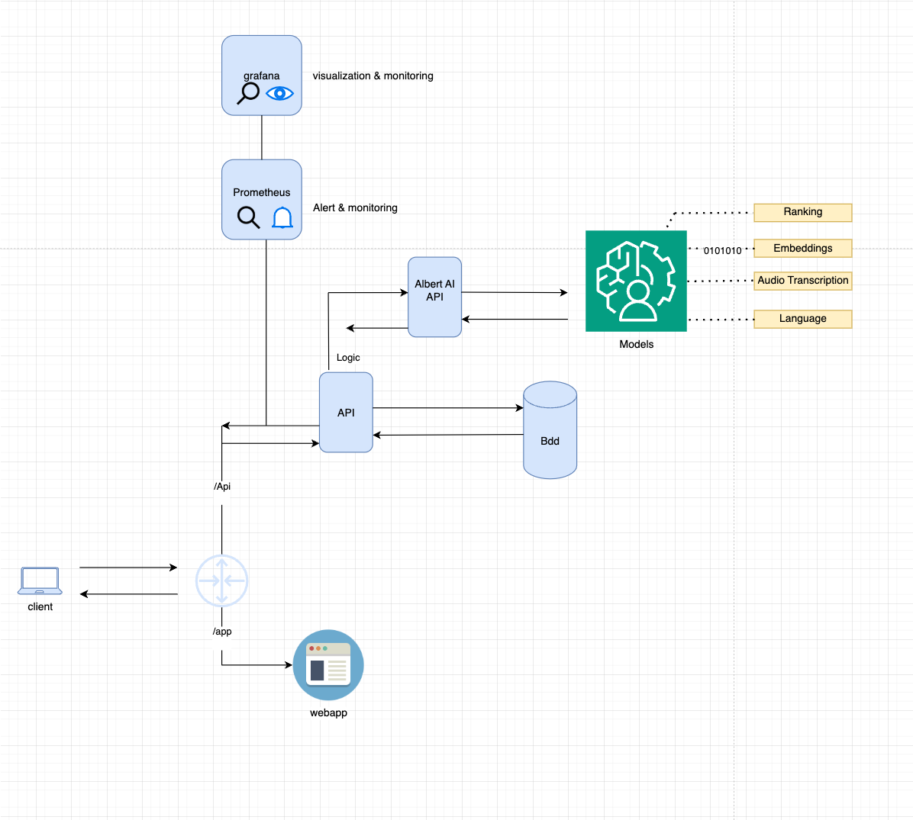
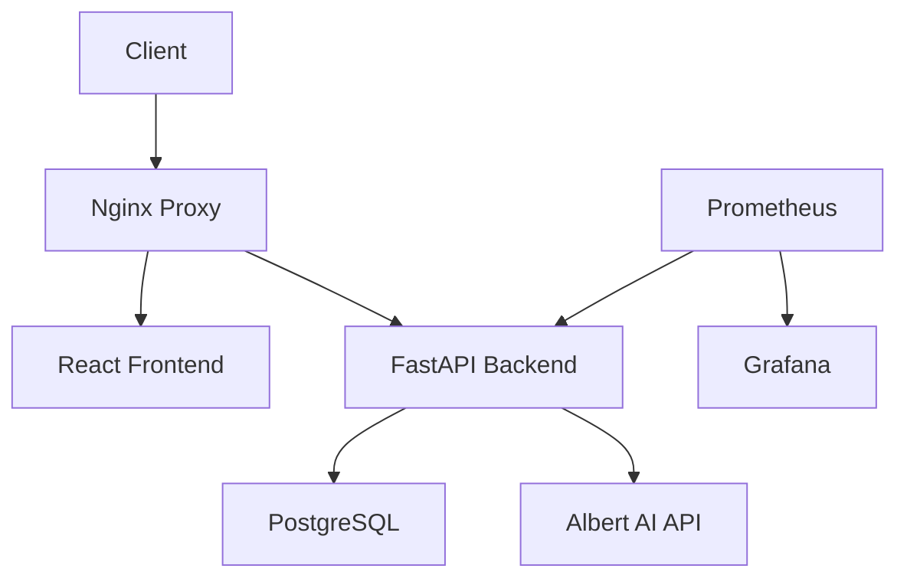
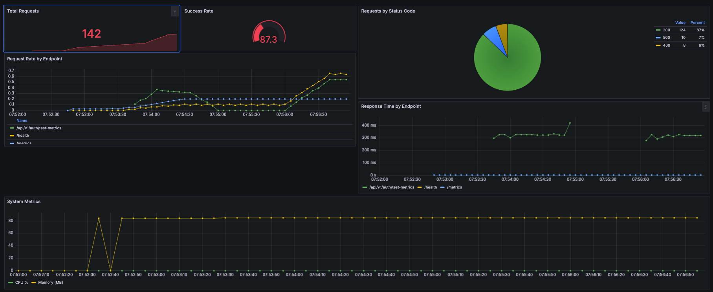

# Albert AI Integration Demo

<div align="center">



*Modern microservices architecture with AI integration*

[](https://fastapi.tiangolo.com/)
[](https://reactjs.org/)
[](https://www.docker.com/)
[](https://prometheus.io/)

</div>

## 📑 Table of Contents
- [Overview](#-overview)
- [Features](#-features)
- [Architecture](#-architecture)
- [Getting Started](#-getting-started)
- [Development](#-development)
- [Monitoring](#-monitoring)
- [Security](#-security)
- [Contributing](#-contributing)

## 🎯 Overview

A demonstration of Albert AI integration - a French government initiative providing state agencies with access to open-source AI models. This project showcases AI-powered assistance for administrative procedures while maintaining data sovereignty.

### Key Benefits
- 🤖 Intelligent administrative assistance
- 🔒 Secure data handling
- 📊 Comprehensive monitoring
- 🚀 Modern tech stack

## 💫 Features

### Core Capabilities
- **AI Chat Interface**
  - Real-time conversations
  - Context-aware responses
  - Multi-language support

- **Document Processing**
  - Smart document analysis
  - Information extraction
  - Secure file handling

- **User Management**
  - JWT authentication
  - Role-based access
  - Session management

## 🏗 Architecture

### Technology Stack

#### Backend (FastAPI)
- FastAPI framework
- PostgreSQL database
- SQLAlchemy ORM
- JWT authentication
- Async operations

#### Frontend (React)
- React 18 with hooks
- Material-UI components
- TypeScript
- Real-time updates
- Responsive design

#### Infrastructure
- Docker containerization
- Nginx reverse proxy
- Redis caching
- Prometheus metrics
- Grafana dashboards

### System Components



## 🚀 Getting Started

### Prerequisites
- Docker and Docker Compose
- Node.js 18+ (development)
- Python 3.11+ (development)
- Albert AI API credentials

### Quick Start
```bash
# Clone repository
git clone[ https://github.com/allglenn/albert-ai-demo.git]
cd albert-ai-demo

# Configure environment
cp api/.env.example api/.env
# Edit api/.env with your credentials

# Launch services
docker-compose up -d

# Access applications
Frontend: http://localhost:3000
API Docs: http://localhost:8000/docs
Monitoring: http://localhost:3001
```

## 📊 Monitoring

Our monitoring solution provides comprehensive insights:



### Key Metrics
- API performance
- System resources
- Business metrics
- Error tracking

### Access Points
```bash
Grafana: http://localhost:3001 (admin/admin)
Prometheus: http://localhost:9090
Raw Metrics: http://localhost:8000/metrics
```

## 🔒 Security

- JWT-based authentication
- CORS protection
- Rate limiting
- Input validation
- Network isolation
- Container security

## 🤝 Contributing

1. Fork the repository
2. Create your feature branch
3. Commit your changes
4. Push to the branch
5. Create a Pull Request

## 📄 License

This project is licensed under the MIT License - see the [LICENSE](LICENSE) file for details.

## 🙏 Acknowledgments

- Albert AI team for the API infrastructure
- French government's digital services
- Open-source community contributors

---

<div align="center">
Made with ❤️ by the Albert AI Integration Team and @allglenn
</div>

