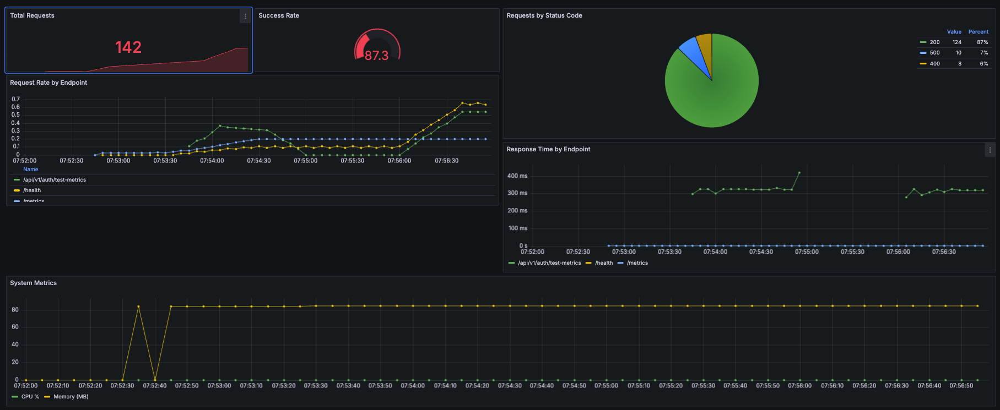

# Albert AI Integration Demo

## Table of Contents
- [About the Project](#about-the-project)
- [Technical Stack](#technical-stack)
- [Features](#features)
- [Monitoring](#monitoring)
- [Project Structure](#project-structure)
- [Getting Started](#getting-started)
- [Development](#development)
- [API Documentation](#api-documentation)
- [Security](#security)
- [Contributing](#contributing)
- [License](#license)
- [Acknowledgments](#acknowledgments)

## About the Project

This project serves as a demonstration of integrating Albert AI, a French government initiative that provides state agencies access to open-source AI models. Albert AI is part of France's strategy to democratize AI usage within public services while maintaining data sovereignty and promoting open-source solutions.

## Technical Stack

### Backend (API)
- **FastAPI**: Modern, fast (high-performance) web framework for building APIs with Python
- **Pydantic**: Data validation using Python type annotations
- **SQLAlchemy**: SQL toolkit and ORM for database operations
- **PostgreSQL**: Robust, open-source database
- **JWT**: JSON Web Tokens for secure authentication
- **Uvicorn**: Lightning-fast ASGI server implementation
- **Python 3.11**: Latest stable version with improved performance

### Frontend (UI)
- **React 18**: JavaScript library for building user interfaces
- **React Hooks**: For state management and side effects
- **Fetch API**: For making HTTP requests to the backend

### Infrastructure & Monitoring
- **Docker**: Containerization of all services
- **Docker Compose**: Multi-container orchestration
- **Prometheus**: Metrics collection and storage
- **Grafana**: Metrics visualization and dashboards
- **Hot Reloading**: Development environment support

## Features

### Core Features
#### Authentication
- Secure JWT-based authentication
- Token blacklisting for logout functionality
- Password hashing with bcrypt
- Protected routes with dependency injection
- Automatic token expiration

#### User Management
- User registration with email validation
- Secure password storage
- User profile retrieval
- Email uniqueness enforcement
- Active/inactive user status

#### Database
- PostgreSQL integration
- Async database operations
- Migration support
- Token blacklist management
- Automatic cleanup of expired tokens

### Monitoring Features

The application includes comprehensive monitoring using Prometheus and Grafana:



#### Metrics Collection
- **Request Metrics**
  - Total request count
  - Request rate by endpoint
  - Success/Error rates
  - Status code distribution
  - Response times

- **System Metrics**
  - CPU usage
  - Memory consumption

#### Dashboard Panels
1. **Total Requests**: Counter showing all API requests
2. **Success Rate**: Gauge showing percentage of successful requests
3. **Status Code Distribution**: Pie chart of response status codes
4. **Request Rate**: Time series of requests per endpoint
5. **Response Time**: Average response time by endpoint
6. **System Resources**: CPU and Memory usage trends

#### Monitoring Setup
```bash
# Start the full stack including monitoring
docker-compose up -d

# Access monitoring interfaces
Grafana: http://localhost:3001 (admin/admin)
Prometheus: http://localhost:9090
```

#### Test Endpoints
```bash
# Generate sample metrics
curl http://localhost:8000/api/v1/auth/test-metrics

# View raw metrics
curl http://localhost:8000/metrics
```

## Project Structure
```
project/
├── api/                      # FastAPI backend
│   ├── controllers/          # Business logic
│   ├── models/              # Pydantic models
│   ├── services/            # Service layer
│   │   └── monitoring.py    # Metrics collection service
│   ├── views/               # API endpoints
│   ├── middleware/          # Middleware components
│   │   └── error_handler.py # Global error handling
│   ├── db/                  # Database models and config
│   ├── utils/               # Utility functions
│   │   └── exceptions.py    # Custom exceptions
│   └── config.py            # Application configuration
├── ui/                      # React frontend
│   └── src/
│       ├── pages/
│       │   ├── public/      # Public (unauthenticated) pages
│       │   │   ├── LandingPage.js
│       │   │   ├── LoginPage.js
│       │   │   └── RegisterPage.js
│       │   └── private/     # Protected (authenticated) pages
│       │       ├── Dashboard.js
│       │       ├── ChatPage.js
│       │       └── ProfilePage.js
│       ├── components/
│       │   └── layout/      # Layout components
│       │       ├── PublicLayout.js
│       │       ├── PrivateLayout.js
│       │       └── Navbar.js
│       └── App.js
├── prometheus/              # Prometheus configuration
│   └── prometheus.yml       # Scraping configuration
├── grafana/                 # Grafana configuration
│   └── provisioning/        # Auto-provisioning
│       ├── dashboards/      # Dashboard definitions
│       └── datasources/     # Data source definitions
└── docker-compose.yml       # Docker composition
```

## Getting Started

1. Clone the repository:
```bash
git clone https://github.com/allglenn/albert-ai-help-bot.git
cd albert-ai-help-bot
```

2. Create a .env file (optional):
```bash
cp .env.example .env
# Edit .env with your Albert AI credentials
```

3. Start the application:
```bash
docker-compose up --build
```

4. Access the application:
- Frontend: http://localhost:3000
- Backend API: http://localhost:8000
- API Documentation: http://localhost:8000/docs

## Development

### Environment Setup

Key environment variables (see .env.example for full list):
- `DATABASE_URL`: PostgreSQL connection string
- `SECRET_KEY`: JWT signing key
- `ALBERT_AI_API_KEY`: API key for Albert AI services
- `DEBUG`: Enable/disable debug mode

### Development Features
- Frontend hot reloading
- Backend auto-reload
- Docker volume persistence
- Database persistence

### Configuration Files
- `prometheus/prometheus.yml`: Prometheus scraping configuration
- `grafana/provisioning/`: Grafana dashboards and data sources
- `api/services/monitoring.py`: Metrics collection setup
- `.env.example`: Environment variable template

## API Documentation

### Authentication Endpoints
- `POST /api/v1/auth/login`: JSON login endpoint
- `POST /api/v1/auth/token`: Form-based login endpoint
- `POST /api/v1/auth/logout`: Logout and invalidate token

### User Endpoints
- `POST /api/v1/users/`: Create new user
- `GET /api/v1/users/me`: Get current user profile
- `GET /api/v1/users/{user_id}`: Get user by ID

## Security
- Password hashing with bcrypt
- JWT token-based authentication
- Token blacklisting for secure logout
- Database-level email uniqueness
- Protected API endpoints
- CORS configuration
- Environment variable separation

## Contributing

Contributions are welcome! Please feel free to submit a Pull Request.

## License

This project is open source and available under the [MIT License](LICENSE).

## Acknowledgments

- Albert AI team for providing the API infrastructure
- French government's digital services for promoting open-source AI solutions

